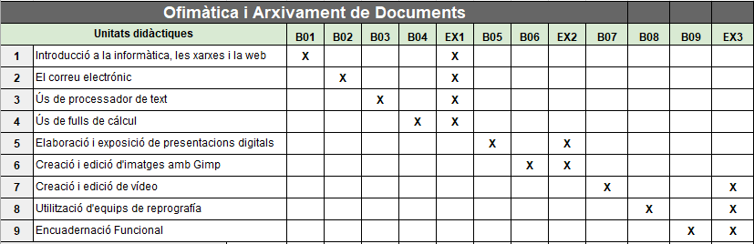
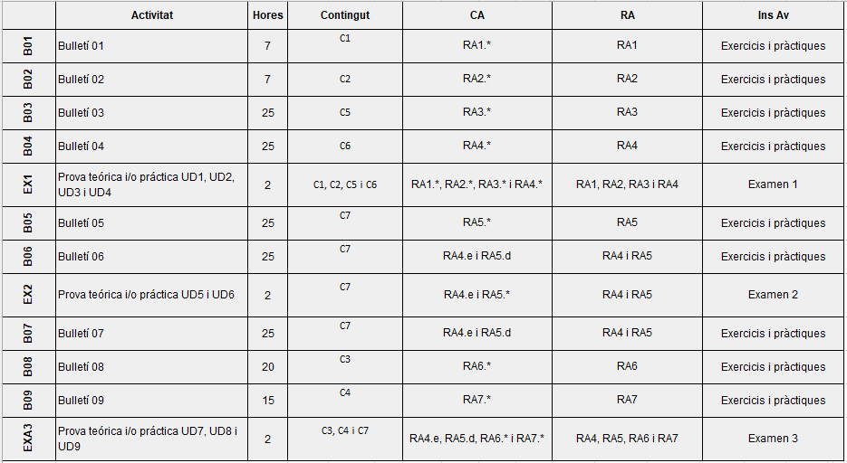

# Avaluació de l’aprenentatge

## Instruments d’avaluació
A continuació indiquem els instruments que ens ajudaràn a avaluar a l’alumne.

## Tipus d’avaluació
La avaluació serà continua i tindrà en compte el progrés de l'alumne.
No obstant, encara que la avaluació es faça continua, hi ha tres moments en els que es materialitza
durant el curs. Estos moments són:

    - Avaluació inicial.
    - Avaluació processal.
    - Avaluació final.

   En el cicle presencial se requereix l’assistència, almenys, al 85% de classes i activitats

   dret a l’avaluació continua i tindrà que presentar-se a la convocatòria ordinaria de tot el curs.

## Recuperació
Quan l’alumne no supere algun resultat d’aprenentatge, podrà dur a terme una recuperació a la
convocatòria ordinària d’allò que li quede per recuperar.

Si encara hi tot no aconseguix recuperar-ho, tindrà una altra oportunitat a la segona convocatòria
ordinària.

El professor, indicarà a l’alumne allò que ha de estudiar i resoldrà els seus dubtes mitjançant activitats,
explicacions o qualsevol instrument que siga oportú per a poder superar aquesta situació.
