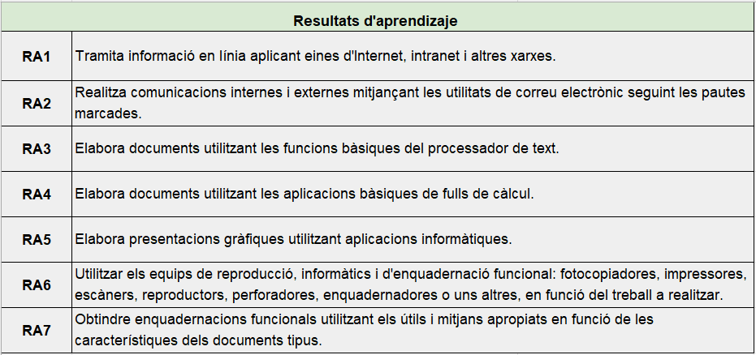
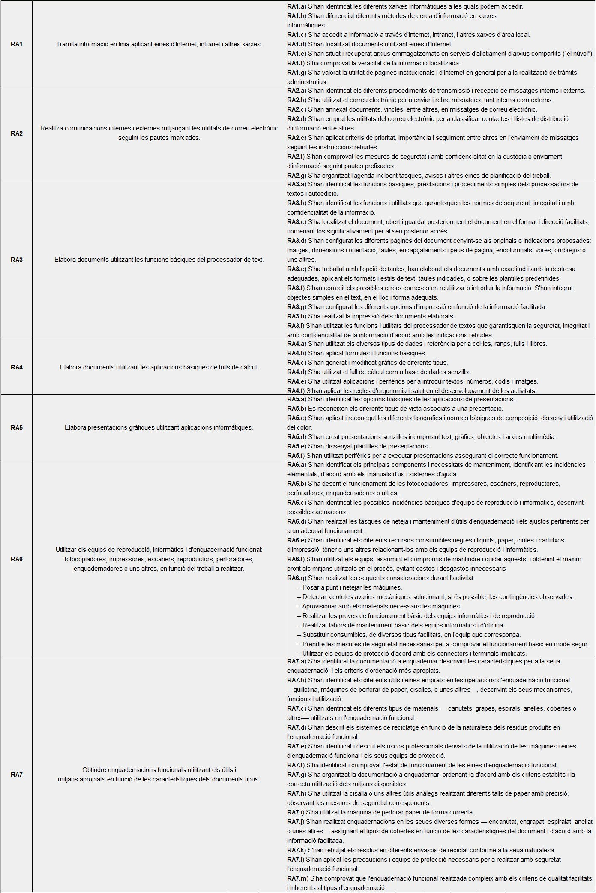

# Resultats d’aprenentatge i criteris d’avaluació

Resultats d’aprenentatge

Els objectius concrets del módul venen representats com a resultats d’aprenentatge.

## Relació entre els resultats d’aprenentatge i els criteris d’avaluació

