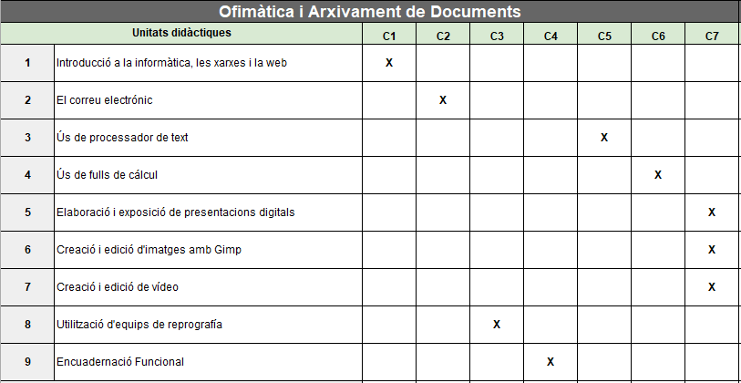
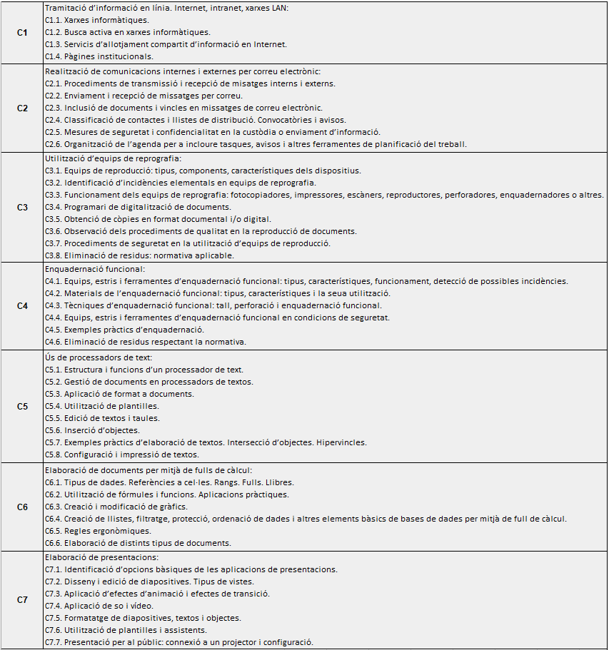
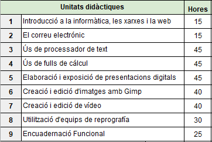

# Continguts, unitats didàctiques i temporalització

Contingut. Unitats didàctiques

## Relació de Unitats Didàctiques i continguts

## Continguts de les unitats didàctiques

## Distribució temporal de les unitats didàctiques
9 Hores a la setmana, un total de tres trimestres per a fer un total de 299h.

A la 1ª avaluació s’impartirà les UD 1, 2, 3 i 4.

A la 2ª avaluació s’impartirà les UD 5 i 6.

A la 3ª avaluació s’impartirà les UD 7, 8 i 9.
